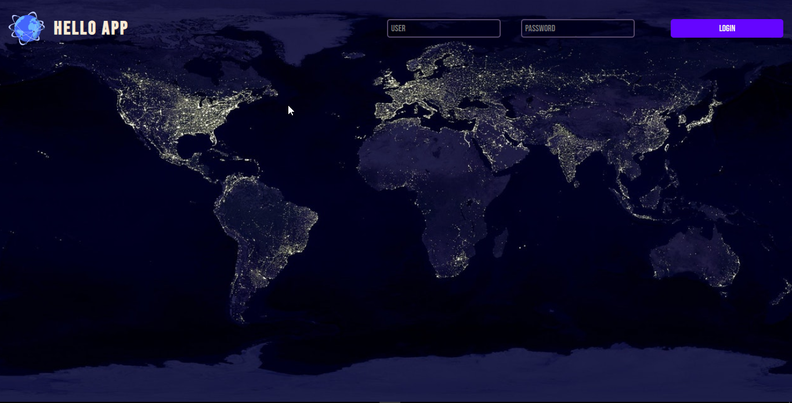

# Hello App

Another proyect from [Florinpop17´s](https://github.com/florinpop17/app-ideas) repo. Responsive on dev. only works on pc.

## Resources

- [HTML](https://developer.mozilla.org/es/docs/Web/HTML)
- [CSS](https://developer.mozilla.org/es/docs/Web/CSS)
- [JavaScript](https://developer.mozilla.org/es/docs/Web/JavaScript)
- [Sass](https://sass-lang.com/)
- [Animate.css](https://animate.style/)
- [Axios](https://github.com/axios/axios)
- [ip-api](https://ip-api.com/docs/api:json)
- [ipify API](https://www.ipify.org/)
- [Hello, Salut!](https://fourtonfish.com/project/hellosalut-api/)

### Screenshots

### Social

- [Github](https://github.com/SevroAuBarca)
- [Twitter](https://twitter.com/ZeroTheFasteer)
- [instagram](https://www.instagram.com/daniel.au.lune/)
